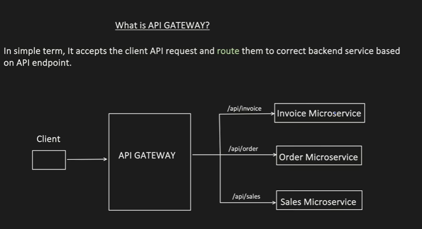
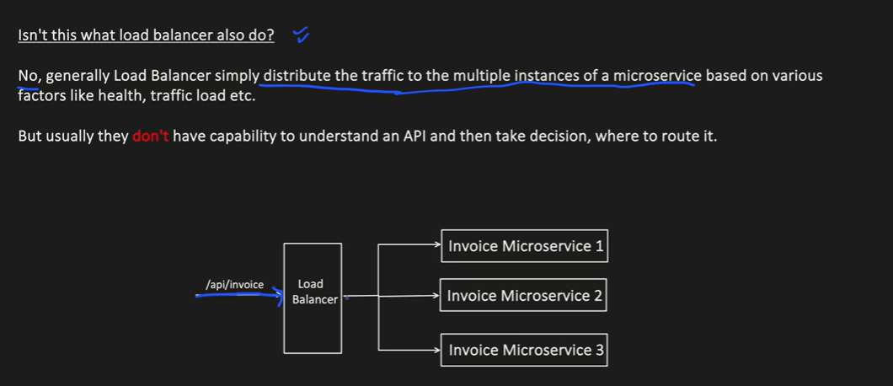
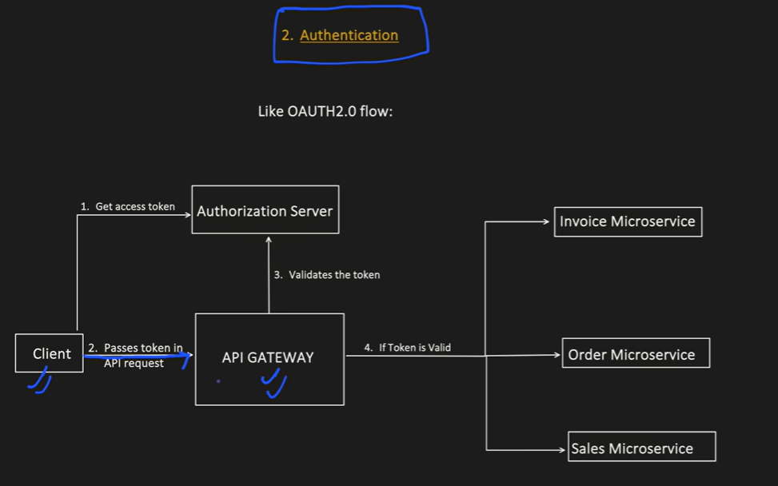
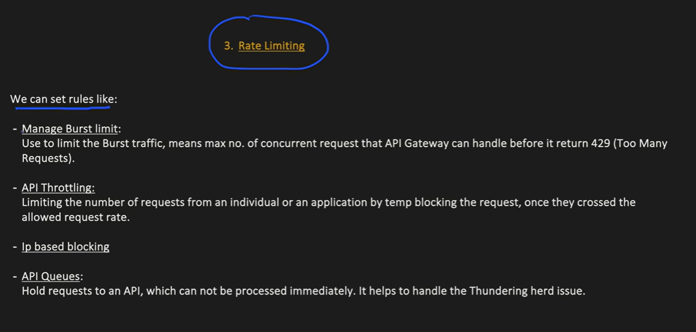
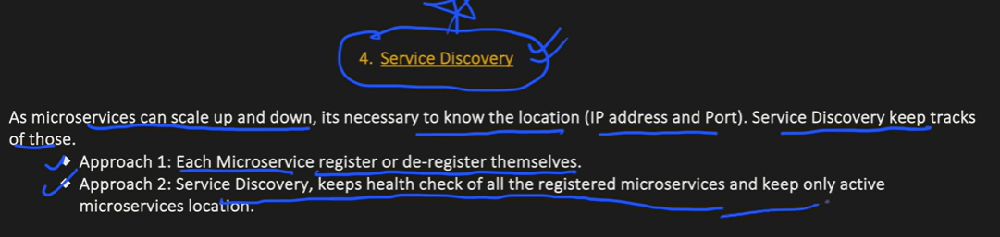
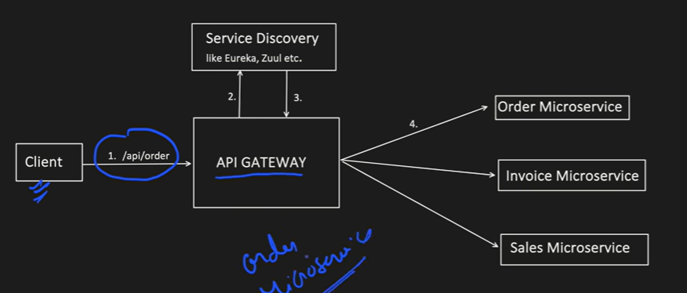

Yes—this is a very common **System Design interview question**. The key is: **API Gateway is a logical single entry point, not necessarily a single physical server.**

### 1. If API Gateway is a single entry point, how can it handle millions of requests/sec?

Imagine:

```text
                 Users
                   |
                   v
          ┌─────────────────┐
          │   Load Balancer │
          └────────┬────────┘
                   |
        ┌──────────┼──────────┐
        v          v          v
   API Gateway  API Gateway  API Gateway
   Instance 1   Instance 2   Instance 3
        |          |          |
        └──────────┼──────────┘
                   |
        ┌──────────┼──────────┐
        v          v          v
    User Service Order Service Payment Service
```

**"Single entry point" means a single logical entry point**, for example:

```text
api.myapp.com
```

It does **not** mean there is only one API Gateway machine.

The API Gateway itself is **horizontally scaled**:

```text
API Gateway
     |
     +-- Instance 1
     +-- Instance 2
     +-- Instance 3
     +-- Instance 4
     +-- ...
```

A **Load Balancer** distributes incoming traffic among those gateway instances.

So if 1 million requests arrive:

```text
1,000,000 requests
        |
        v
   Load Balancer
        |
   ┌────┼────┬────┐
   v    v    v    v
 250k 250k 250k 250k
   |    |    |    |
   GW1  GW2  GW3  GW4
```

That's how the system can handle very high traffic.

---

# 2. API Gateway vs Load Balancer

They solve **different problems**.

### Load Balancer

Main job:

> **Distribute traffic across multiple instances.**

Example:

```text
             Load Balancer
             /     |     \
            /      |      \
           v       v       v
        Server1 Server2 Server3
```

It mainly asks:

> "Which server should receive this request?"

---

### API Gateway

Main job:

> **Act as the entry point and apply API-level logic before forwarding the request.**

For example:

```text
Client
  |
  v
API Gateway
  |
  +-- Authentication
  +-- Authorization
  +-- Rate Limiting
  +-- Logging
  +-- Request Validation
  +-- Routing
  +-- API Versioning
  |
  v
Microservices
```

It asks:

> "What kind of request is this, is the client allowed, and which service should handle it?"

---

# 3. Does API Gateway come before or after Load Balancer?

**There is no single mandatory architecture.**

But a very common architecture is:

```text
Internet
   |
   v
Load Balancer
   |
   v
API Gateway cluster
   |
   +------> User Service
   |
   +------> Order Service
   |
   +------> Payment Service
```

Here:

### Load Balancer

```text
"Which API Gateway instance?"
```

### API Gateway

```text
"Which microservice?"
```

So:

```text
              Load Balancer
                    |
          ┌─────────┼─────────┐
          v         v         v
        GW-1      GW-2      GW-3
          |         |         |
          └─────────┼─────────┘
                    |
              API Routing
             /      |      \
            v       v       v
         User     Order   Payment
        Service  Service  Service
```

### Interview shortcut 🧠

Remember:

> **Load Balancer = Which instance?**
> **API Gateway = Which service + API policies?**

And:

> **"Single entry point" ≠ "single server."**

The gateway is usually **deployed as multiple instances behind a load-balancing/scaling layer**, so there is no single point of failure.

============================================



Exactly. 👍 The diagram is showing the **basic/ideal role of an API Gateway**.

### What is API Gateway?

In simple terms:

> **API Gateway is the single logical entry point between clients and backend services. It receives client requests and routes them to the correct microservice.**

From your diagram:

```text
Client
   |
   |  /api/order
   v
API Gateway
   |
   |---- /api/invoice ---> Invoice Microservice
   |
   |---- /api/order   ---> Order Microservice
   |
   |---- /api/sales   ---> Sales Microservice
```

### How does routing happen?

Suppose the client sends:

```text
GET /api/order/123
```

The request first reaches:

```text
API Gateway
```

Gateway looks at the endpoint:

```text
/api/order
```

and knows:

```text
/api/order  ---> Order Microservice
```

So it forwards the request:

```text
Client
  |
  | GET /api/order/123
  v
API Gateway
  |
  | GET /api/order/123
  v
Order Microservice
```

Similarly:

```text
/api/invoice  ---> Invoice Microservice
/api/order    ---> Order Microservice
/api/sales    ---> Sales Microservice
```

---

## But remember: routing is only ONE job

The diagram shows the **simplest responsibility** of an API Gateway.

In a real microservices system, it can also handle:

```text
                    API Gateway
                         |
       ┌─────────────────┼─────────────────┐
       ↓                 ↓                 ↓
 Authentication      Rate Limiting       Routing
 Authorization       Logging             Validation
 SSL/TLS              Monitoring         API Versioning
       |
       v
  Microservices
```

For example:

```text
Client
  |
  v
API Gateway
  |
  |-- Is user authenticated?
  |-- Is request allowed?
  |-- Has rate limit exceeded?
  |-- Which service?
  |
  v
Order Service
```

### One important correction to the diagram

The box saying **API Gateway** does **not necessarily mean one physical server**.

It can actually be:

```text
                 Load Balancer
                      |
          ┌───────────┼───────────┐
          ↓           ↓           ↓
       Gateway 1   Gateway 2   Gateway 3
          \           |           /
           \          |          /
            └─────────┼─────────┘
                      |
              Microservices
```

So:

**Single entry point = one logical endpoint**

**Not = one gateway machine.**

### Interview definition 🎯

===============================================


> **API Gateway is a single logical entry point for clients in a microservices architecture. It receives client requests, performs cross-cutting concerns such as authentication, authorization and rate limiting, and routes each request to the appropriate backend microservice.**

That is a strong interview answer.
============================================



========================================

# API Gateway — Other Capabilities

Apart from **Routing**, API Gateway provides several other capabilities.

## 1. API Composition

### Problem

Suppose the client is visiting the **"My Orders"** page.

A mobile client may need:

```text
Mobile Device Client
        |
        v
      REST APIs
        |
        +----> API to fetch Product Details
        |
        +----> API to fetch Invoice Details
```

A PC client may need even more APIs:

```text
PC Device Client
        |
        v
      REST APIs
        |
        +----> API to fetch Product Details
        |
        +----> API to fetch Invoice Details
        |
        +----> API to fetch Ratings and Reviews
        |
        +----> API to fetch Recommendations
```

### Without API Composition

The client has to make multiple API calls itself:

```text
Client
  |
  +----> Product API
  |
  +----> Invoice API
  |
  +----> Ratings & Reviews API
  |
  +----> Recommendation API
```

This makes the client's job more complicated.

---

## API Composition with API Gateway

The **API Gateway makes the client's life easier** through API Composition.

The client makes **one request**:

```text
Client
  |
  | /api/myOrder
  v
API Gateway
```

The API Gateway then calls multiple backend systems:

```text
                         +----> Product System
                         |
Client ---> API Gateway -+----> Invoice System
                         |
                         +----> Ratings and Review System
                         |
                         +----> Recommendation System
```

The gateway:

1. Receives the client's request.
2. Calls multiple backend services.
3. Fetches the required details.
4. Joins/combines the responses.
5. Returns a single response to the client.

### Simple Example

```text
Client
  |
  | GET /api/myOrder
  v
API Gateway
  |
  +----> Product System       → Product details
  |
  +----> Invoice System       → Invoice details
  |
  +----> Ratings System       → Ratings/reviews
  |
  +----> Recommendation       → Recommendations
  |
  v
Combined Response
  |
  v
Client
```

### Interview Definition

> **API Composition is a capability of an API Gateway where the gateway calls multiple backend services, combines their responses, and returns a single aggregated response to the client.**

### Remember

**Without API Composition:**

```text
Client → Multiple APIs
```

**With API Composition:**

```text
Client → API Gateway → Multiple Services
                     ↓
              Combined Response
                     ↓
                   Client
```
====================================================
====================


============================

============================


=================================
